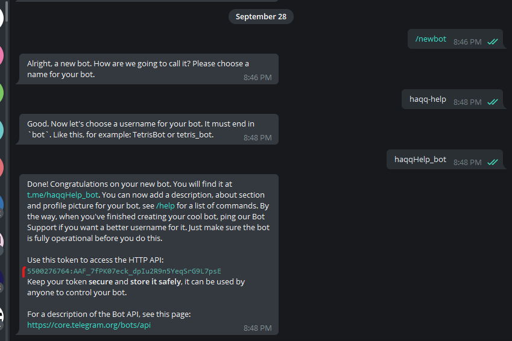
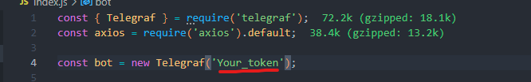
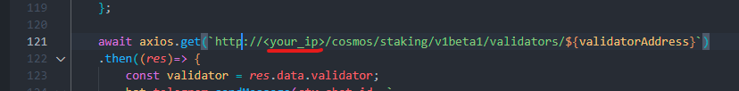
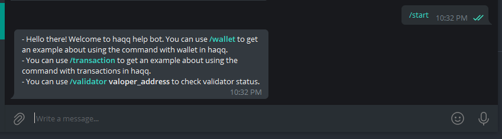

## Haqq Help Bot
The repo to create the telegram bot use telegraf library. The bot is a tip bot in haqq and queries validator.

## Create a bot in telegram

go to: https://t.me/BotFather and follow steps to create a bot. When you had a telegram bot then you had a token. It like that:



Save the token.

## Run bot
Clone this repository and update your token to this in `index.js`



Update your vps which is running haqq node:



After update and save file run command below:

```
npm i && npm run
```

## Test bot

go to <b>@your_bot_name</b> in telegram

chat '<i>/start</i>' to that you can see that:



You can follow the guide to test. You can use this repository to create an other new feature thanks.

You can go https://t.me/haqqHelp_bot to try it.

Thanks.

